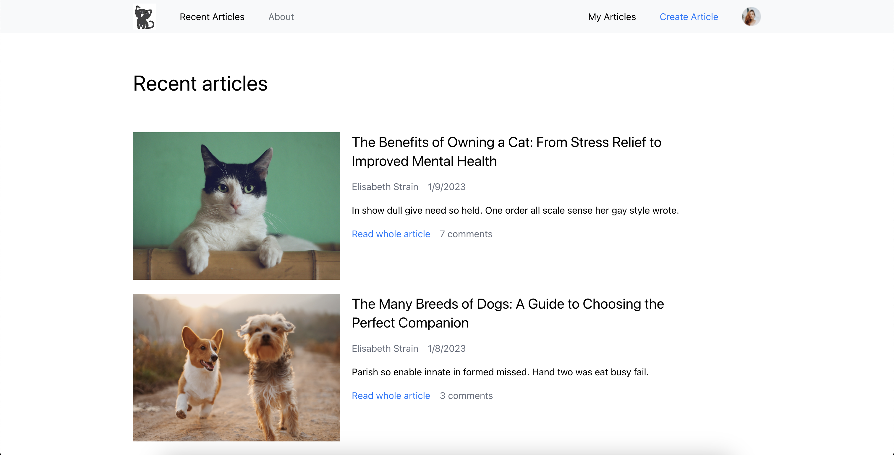

# Applifting task

Post application




### For this project I have used these technologies:

- [React](https://reactjs.org/)
- [TypeScript](https://www.typescriptlang.org/)
- React-redux / Redux-toolkit
- react-router-dom
- webpack
- axios
- [Tailwind](https://tailwindui.com/)
- MaterialUI

## Credentials
```
    username: admin
    password: admin 
```

## How to start

#### Intall [Node.js](https://nodejs.org/en/)

#### Clone project

#### In root directory run

```
npm install
```

#### Run project

```
npm run start
```
- Open http://localhost:8080 
#### Start json-server for API
```
npm run server
```
- Server will be available on port http://localhost:3000

## How to build

```
    npm run build
```
## Available Scripts

In the project directory, you can run:

### `npm run start`
### `npm run build`
### `npm run server`